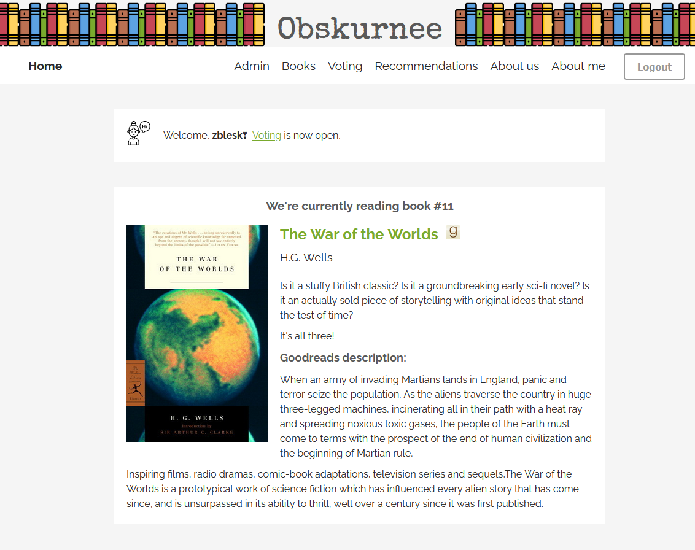
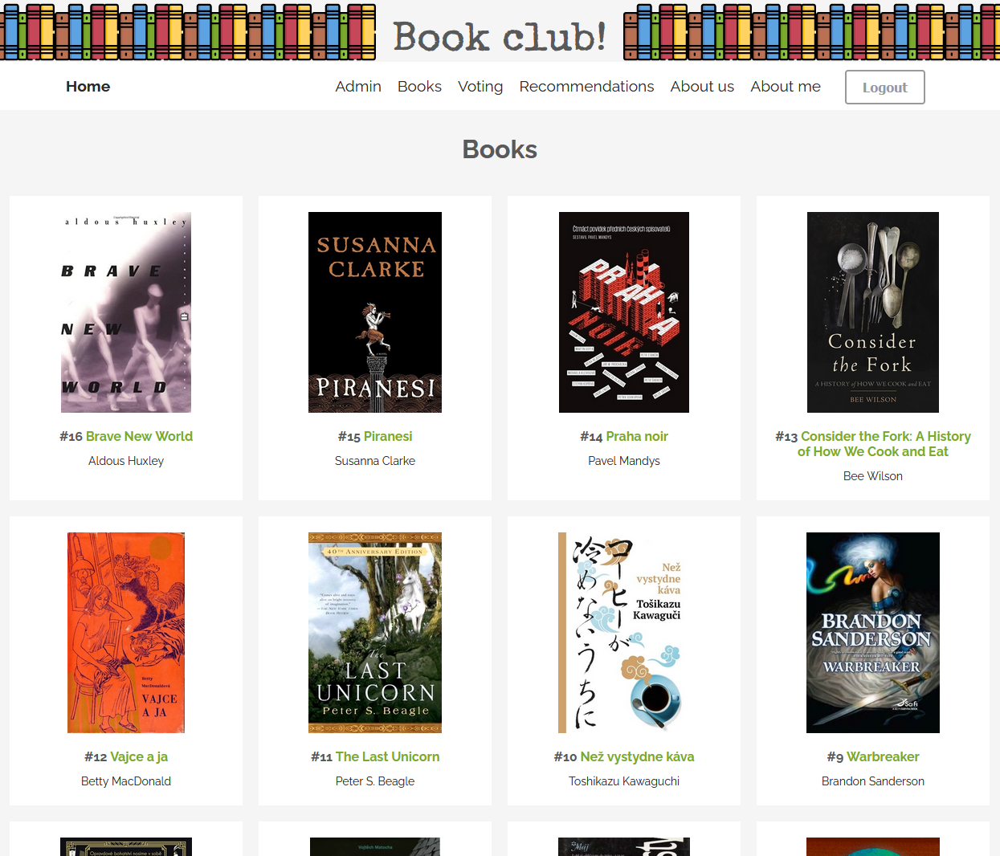
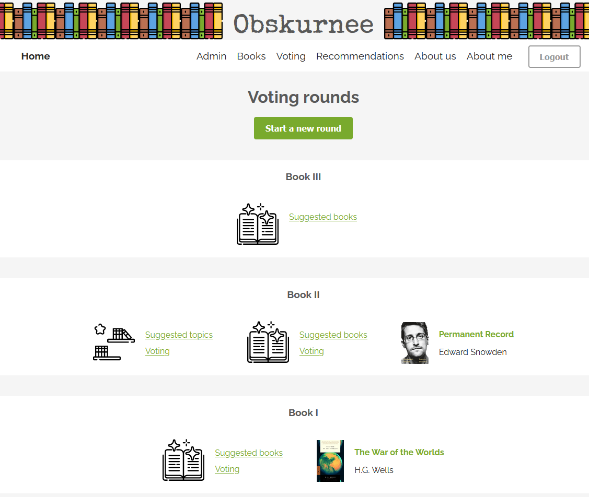
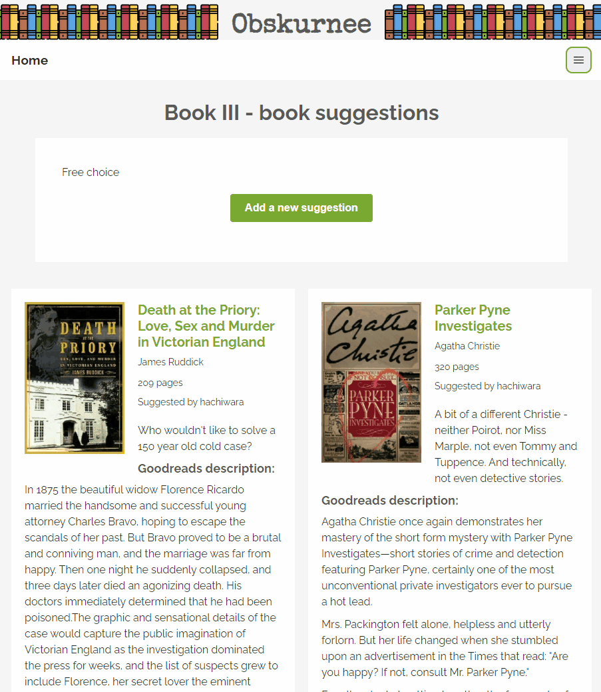

# Obskurnee - a companion for your Book club


[](https://bzzz.zble.sk/zblesk/Obskurnee)

**Do you have a book club? Are you looking for an app that would let you suggest books to one another, then vote for the ones you're going to read next? Would you like Goodreads integration? Then Obskurnee might be for you.**

Obskurnee is a simple, user-friendly web app that will help you decide on your book club's next read. It will also let you add book recommendations when you've read something you Just Have To Tell Everyone About. You can review the books your Book club has read and share the ones you're currently reading (via Goodreads). But not much else. We've kept the feature set small by design - we wanted to implement the workflow we use, not cover every possible use-case.

Our aim was to make the app user friendly and intuitive to use. 

>  ℹ Keep in mind: there is no 'central service' where you could register and just start using the app, at least not for now. You have to run the web app yourself. If you just want to check it out, have a look at the [demo](https://obskurnee.zblesk.net/). Simply log in with any made-up email address and password.

>  ℹ The [GitHub](https://github.com/zblesk/obskurnee) repository is a mirror. 

>  ℹ Some features you might expect from an app are still missing. Since our free time is limited, we made a polished MVP we were able to start using straight away; we expect to be adding more in the future, but it might take a while.

**Available in English and Slovak**.

If you want to chat, feel free to join Obskurnee's Matrix chat room at [#obskurnee:zble.sk](https://matrix.to/#/#obskurnee:zble.sk).

# Features and screenshots

The way Obskurnee works is simple: When your book club is ready for a new book, a moderator opens a new voting round. **All members can add any number of suggestions. Once a moderator closes the round, a poll is automatically generated. When all members have voted, the poll is evaluated and the chosen book is featured on the home page.**

Aside from the current book, the home page features a global notice board (empty and thus hidden on this screenshot), and ongoing activities, such as voting.



A shelf for all the books you've read together. Users can **rate and review** any of these books.



Voting rounds offer two options: either a direct vote for books or the choice of a round with specific topics.



The **topic** option entails a vote in two stages. First, the members suggest book topics (such as a particular genre, year of publication, nationality of author etc.), and once the winning theme is selected, a new round for **books** related to this theme is automatically opened.

The easiest way to add a book is to copy and paste a Goodreads URL and wait for it to be scraped, with the option to add further comments. All large text fields support **Markdown**. Everything you'd expect from MD should be there; plus, you can use `::this::` to mark a spoiler.




**Recommendations** work in the same way as the books suggested for voting, except they're not tied to a specific round. Use these as general recommendations for other members of the book club.

Only **moderators can add new users** (though this is disabled in the demo). Once logged in, **new users are prompted to fill out their profiles** - especially their Goodreads profile (which is also used to **load their "Currently Reading" shelf**), phone number (since we mainly communicate over Whatsapp), and a brief bio about themselves and/or their reading preferences. Each user's page also shows their reviews and recommendations.

# [Try the demo](https://obskurnee.zblesk.net/)

**Enter *any* email and password.**

# Setup and tech info

⚠ **Obskurnee is meant to run behind a proxy.** It does not offer built-in HTTPS support. Do not expose your instance directly to the internets.

## Quickstart

To try it out, run `docker run -p 8080:8080 -e DefaultCulture=en zblesk/obskurnee`.

Then navigate to http://localhost:8080/setup and create the first user.

## Docker-compose

The above doesn't persist your data, so while good for giving Obskurnee a try, don't run it in prod like that. 

A minimal setup with persistence and mailing via Mailgun looks like this:

```yaml
version: "3"

services:
  obskurnee:
    image: zblesk/obskurnee:latest
    restart: unless-stopped
    ports:
      - 8080:8080
    volumes:
      - ./data:/obskurnee/data
    environment:
      - SiteName=Book club!
      - BaseUrl=https://obskurnee.mydomain.com
      - DefaultCulture=en
      - SymmetricSecurityKey=87965trfvbh86somebigrandomsecuritykeyhere
      - MailerType=mailgun
      - Mailgun__EndpointUri=https://api.mailgun.net/v3/
      - Mailgun__SenderEmail=Bookclub <bookclub@mydomain.com>
      - Mailgun__SenderDomainName=mydomain.com
      - Mailgun__ApiKey=key-super1337secret
```

Change the environment variables to your real values; most importantly, mind that you set the path in `volumes` (i.e. `./data` in the example) to a location where you want all the application's data stored.

Save it as `docker-compose.yml` and start with `docker-compose up`. 

Then navigate to http://localhost:8080/setup and create the first user.

## nginx reverse proxy config

[Here's a blog post](https://zblesk.net/blog/putting-obskurnee-behind-a-proxy/) with some technical background. The important part right now is that some features use Signlar, which uses WebSockets, so the proxy must needs take that into account.

```conf
map $http_connection $connection_upgrade {
    "~*Upgrade" $http_connection;
    default keep-alive;
}

server {
    server_name obskurnee.mydomain.com;

    location /hubs {
       proxy_pass http://127.0.0.1:8080;
       proxy_set_header Upgrade $http_upgrade;
       proxy_set_header Connection $connection_upgrade;
       proxy_cache off;
       proxy_buffering off;
       proxy_read_timeout 100s;

       proxy_set_header Host $host;
       proxy_set_header X-Forwarded-For $proxy_add_x_forwarded_for;
       proxy_set_header X-Forwarded-Proto $scheme;
     }

    location / {
       proxy_pass http://127.0.0.1:8080;

       proxy_http_version 1.1;
       proxy_set_header Upgrade $http_upgrade;
       proxy_set_header Connection keep-alive;
       proxy_set_header Host $host;
       proxy_cache_bypass $http_upgrade;
       proxy_set_header X-Forwarded-For $proxy_add_x_forwarded_for;
       proxy_set_header X-Forwarded-Proto $scheme;

       proxy_connect_timeout 100s;
       proxy_read_timeout 100s;

       gzip_types application/json application/javascript;
       gzip_proxied no-cache no-store private expired auth;
     }
}
```

# Development 

You will need .NET 8.0 and Node 18.

1. Clone repo
2. `cd .\Obskurnee\obskurnee.client\`
3. `npm install`
4. `cd ..\Obskurnee.Server\`
5. `dotnet run`

That should let you access your local copy at localhost.

Or just open the `.sln` file in Visual Studio  2022 and let it handle the rest.

# License

Copyright (c) 2021 Ladislav Benc

Personal Use License

Obskurnee is available for personal use only. Feel free to run it for yourself and/or your friends on your own server, for non-commercial purposes only. 

Software is provided without any guarantees. Use at your own risk. 